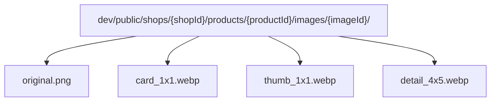

# Product Images

This document summarizes how product images move through the system:

- how original product images are uploaded
- how image variants are generated
- how product image records are stored in the database
- how object storage keys are shaped
- how storefront resolves and uses original images versus variants

## Overview

The product image pipeline has two layers:

1. Original image storage
2. Derived variant generation

The original image is the source of truth. Variants are generated from the original and stored as separate objects under the same product image subtree.

At a high level:

1. Seller uploads or submits product images.
2. API stores the original image under a structured public storage key.
3. API persists `product_images` rows for the original image keys.
4. A background job generates resized variants for each original image.
5. API persists `product_image_variants` rows for each generated variant.
6. Public product detail responses include both the original image and any generated variants.
7. Storefront chooses which variant to use for each UI surface.

```mermaid
flowchart LR
    A["Seller upload"] --> B["Store original object"]
    B --> C["Persist `product_images` row"]
    C --> D["Dispatch `product.generate-image-variants` job"]
    D --> E["Load original from storage"]
    E --> F["Generate configured variants"]
    F --> G["Persist `product_image_variants` rows"]
    G --> H["Return original + variants in public product detail API"]
    H --> I["Storefront chooses original or variant per UI surface"]
```



## Data Model

Two database entities represent the image pipeline.

### `product_images`

Each row represents one original product image.

Key fields:

- `storage_key`: object storage key for the original image
- `rank`: display order for the image within the product
- `variant_status`: generation lifecycle status
- `variant_error`: latest generation failure message, if any
- `variants_generated_at`: last successful generation timestamp

The image entity also owns a one-to-many relation to generated variants.

### `product_image_variants`

Each row represents one derived image variant for one original image.

Key fields:

- `variant`: variant name such as `thumb_1x1`
- `storage_key`: object storage key for the generated asset
- `width`
- `height`
- `format`

Variants are unique per `(image, variant)`.

## Upload Flows

There are two main ways original product images enter storage.

### Standard seller upload flow

The API issues an upload destination in `IssueProductImageUploadUrlUseCase`.

That use case:

- verifies the actor can manage the shop
- validates the content type is an image
- creates a new product image storage key
- returns either:
  - a presigned URL for object storage, or
  - a temporary upload ticket for local-mode storage flows

Original uploads use the `original` filename segment.

Example shape:

```text
dev/public/shops/{shopPublicId}/products/{productPublicId}/images/{imageId}/original.webp
```

### Direct set-images flow

`SetProductImagesUseCase` accepts uploaded files directly, stores them as originals, replaces the product's current image set, then dispatches the image variant generation job.

That flow also deletes old original objects after replacement succeeds.

## Variant Generation

Variant generation is handled by:

- `GenerateProductImageVariantsJob`
- `ProductImageService.generateVariants`

When the job runs for a product:

1. It loads the product with images and existing variants.
2. It marks each image as `PROCESSING`.
3. It downloads each original image from storage.
4. It generates every configured variant.
5. It upserts `product_image_variants` rows.
6. It removes stale variants that are no longer configured.
7. It marks the image as `READY` or `FAILED`.

If generation fails for an image:

- `variant_status` becomes `FAILED`
- `variant_error` stores a truncated error message

## Variant Catalog

Configured variants live in `product-image-variant.config.ts`.

Current variants:

- `original`
  - not generated as a derivative
  - this is the uploaded source image
- `card_1x1`
  - `600x600`
  - `fit: cover`
  - `webp`
  - `removeBackground: true`
- `thumb_1x1`
  - `200x200`
  - `fit: cover`
  - `webp`
  - `removeBackground: true`
- `detail_4x5`
  - `1200x1500`
  - `fit: contain`
  - `webp`
  - `background: #ffffffff`
  - `removeBackground: true`

Interpretation:

- `cover` fills the target frame and may crop
- `contain` preserves the whole source image and may pad
- `background` controls the padding color for `contain`

## Image Transform Behavior

Sharp-based transforms are implemented in `SharpImageTransformService`.

Each transform can apply:

- resize width and height
- `fit` mode
- output format conversion
- output quality
- optional background removal
- optional resize background color

### Background removal

The current background-removal logic:

- inspects corner pixels
- infers a uniform border-connected background color
- flood-fills that border-connected region
- converts the removable background region to transparency

This is intentionally conservative. If the corners are not uniform enough, the original image is preserved.

### Padding behavior

If a variant uses `fit: contain`, Sharp preserves the full subject and fills the remaining area.

Important consequence:

- `contain` does not remove empty space
- it only changes what color the empty space becomes

That is why:

- `contain` + no explicit background used to show black padding
- `contain` + white background now shows white padding

If a UI must avoid visible padding entirely, it should either:

- use the original image, or
- use a `cover` variant and accept cropping

## Storage Layout

Product images use the shared structured storage key builder.

General format:

```text
{env}/{visibility}/shops/{shopId}/products/{productId}/images/{imageId}/{filename}.{extension}
```

For product images:

- `env`: `dev`, `test`, or `prod`
- `visibility`: currently `public`
- `shops/{shopId}`: shop path node
- `products/{productId}`: product path node
- `images/{imageId}`: image collection plus one logical image subtree
- `{filename}`: `original`, `card_1x1`, `thumb_1x1`, or `detail_4x5`

Example object group for one product image:

```text
dev/public/shops/e90c4e7e4b95/products/ccf77731b880/images/hero/original.png
dev/public/shops/e90c4e7e4b95/products/ccf77731b880/images/hero/card_1x1.webp
dev/public/shops/e90c4e7e4b95/products/ccf77731b880/images/hero/thumb_1x1.webp
dev/public/shops/e90c4e7e4b95/products/ccf77731b880/images/hero/detail_4x5.webp
```

The original and all generated variants share the same image subtree. Only the filename and extension differ.



## Seed Storage Behavior

`just storage-fresh` only does this:

1. clears object storage
2. reruns `storage-seed`

It does not change geometry rules by itself.

`storage-seed` uploads through the configured storage backend and then runs the same product image variant generation service used by runtime product uploads.

`storage-seed` uploads:

- seeded category assets
- seeded original product images
- seeded generated product image variants using the current variant config and Sharp transform service

That means a storage refresh reflects current transform code, but it still obeys the configured `fit` behavior.

## API Response Shape

Public product detail responses include:

- original image key and optional resolved URL
- generation status fields
- a `variants` object keyed by variant name

Example conceptual response fragment:

```json
{
  "images": [
    {
      "id": "image-1",
      "storage_key": "dev/public/shops/shop-1/products/product-1/images/image-1/original.png",
      "variant_status": "ready",
      "variants_generated_at": "2026-05-31T15:44:14.000Z",
      "variants": {
        "thumb_1x1": {
          "storage_key": "dev/public/shops/shop-1/products/product-1/images/image-1/thumb_1x1.webp",
          "width": 200,
          "height": 200,
          "format": "webp"
        },
        "detail_4x5": {
          "storage_key": "dev/public/shops/shop-1/products/product-1/images/image-1/detail_4x5.webp",
          "width": 1200,
          "height": 1500,
          "format": "webp"
        }
      }
    }
  ]
}
```

## Storefront Consumption

Storefront resolves public URLs with `resolveProductImageUrl`.

That helper:

- prefers a requested variant if present
- falls back to the original image if the variant is missing
- builds a public URL from `assetHost + storage_key` when a direct URL is not already supplied

Typical usage pattern:

- square thumbnail surfaces use `thumb_1x1`
- card or listing surfaces can use `card_1x1`
- product detail page can use:
  - original image for no forced padding/cropping
  - `detail_4x5` if a normalized portrait canvas is explicitly desired

## PDP Recommendation

For product detail galleries, the safest default is:

- use original image for the main gallery image
- use square variants for thumbnails
- reserve padded or cropped variants for surfaces that need uniform grid presentation

Why:

- original image avoids accidental bars introduced by `contain`
- original image avoids unintended subject crop introduced by `cover`
- thumbnails still benefit from normalized square assets

## Operational Notes

- variant generation is asynchronous for seller uploads
- original images remain the source of truth
- changing variant config does not retroactively update already-generated objects until variants are regenerated
- stale configured variants are deleted during regeneration
- UI issues involving black or white bars are usually a `contain` and aspect-ratio decision, not a storage bug

## Related Files

- `apps/api/api/src/modules/domains/product/app/config/product-image-variant.config.ts`
- `apps/api/api/src/modules/shared/image/infra/sharp-image-transform.service.ts`
- `apps/api/api/src/modules/domains/product/app/services/product-image.service.ts`
- `apps/api/api/scripts/upload-minio-assets.ts`
- `apps/api/api/src/modules/domains/product/app/use-cases/issue-product-image-upload-url/issue-product-image-upload-url.use-case.ts`
- `apps/api/api/src/modules/domains/product/app/use-cases/set-product-images/set-product-images.use-case.ts`
- `apps/api/api/src/modules/domains/product/api/rest/public-product-detail.presenter.ts`
- `apps/web/apps/storefront/src/shared/utils/storage-public-url.ts`
