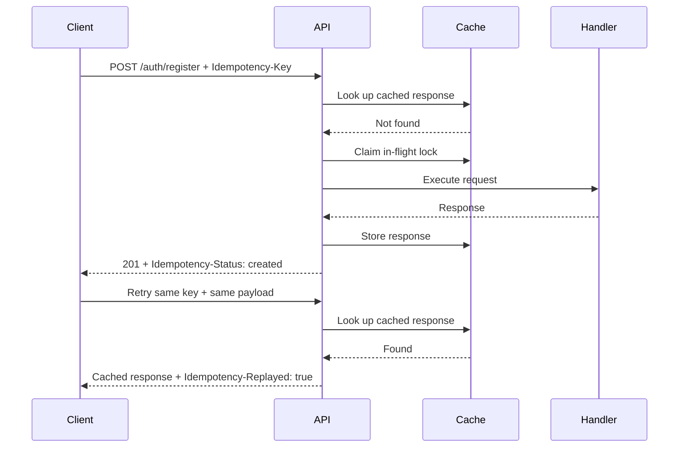

# Idempotency

This API uses idempotency keys for retry-safe HTTP operations that create state,
start workflows, or trigger side effects.

The pattern lets a client retry the same request without accidentally executing
the operation more than once.

## When To Use

Use idempotency on unsafe endpoints when duplicate execution would be harmful or
confusing.

Good candidates:

- registration or account creation
- payment, billing, or subscription operations
- write operations that enqueue jobs or emit events
- operations called by clients that may retry after timeouts
- create commands where the client cannot safely know whether the first request
  completed

Do not add idempotency to simple reads. Also avoid using it as a replacement for
domain-level uniqueness constraints, authorization checks, transactions, or
proper retry handling around external systems.

## Request Contract

Clients send an idempotency key with the request:

```txt
Idempotency-Key: register-1
```

The key should be unique for one logical client operation. A client retrying the
same logical operation should reuse the same key and the same request payload.

The server scopes keys per operation. For example, `auth:register` and
`billing:create-subscription` should not share the same idempotency namespace.

## Request Flow



## Replay Behavior

When the first request succeeds, the API caches:

- a stable fingerprint of the request body
- the response body
- the HTTP status code

If a later request uses the same scope, idempotency key, and request payload, the
API returns the cached response instead of executing the handler again.

Replay responses include:

```txt
Idempotency-Status: cached
Idempotency-Replayed: true
```

The first successful request includes:

```txt
Idempotency-Status: created
```

## Conflict Behavior

The API rejects unsafe reuse of a key with `409 Conflict`.

This happens when:

- the same key is reused with a different request payload
- the same key is already being processed by an in-flight request

The different-payload check prevents a client from accidentally treating one
operation key as reusable across unrelated writes.

The in-flight check prevents two concurrent requests with the same key from
executing the operation twice before a cached response exists.

## Fingerprint

The current implementation fingerprints the request body with stable JSON
stringification.

Object keys are sorted before stringification, so these payloads produce the
same fingerprint:

```json
{ "email": "member@example.com", "password": "password123" }
```

```json
{ "password": "password123", "email": "member@example.com" }
```

The fingerprint is used only to compare retries for the same idempotency key. It
is not a request signature and should not be treated as a security boundary.

## TTLs

Defaults:

- cached response TTL: 24 hours
- in-flight lock TTL: 30 seconds

Override these only when the endpoint has a clear operational reason.

Use a longer response TTL when clients may retry after long network failures.
Use a shorter response TTL when replaying old responses would be surprising.
Use a longer in-flight TTL only when the handler is expected to run longer than
30 seconds.

## Storage

The implementation prefers Redis-backed coordination.

Redis is used for in-flight request locks when the cache driver is Redis. This
matters for multi-process or multi-instance deployments because in-memory locks
only coordinate inside one Node.js process.

If Redis or the cache layer is unavailable, the implementation falls back to
in-memory coordination and response caching. Treat that fallback as degraded
behavior for local development or partial outages, not as a production
consistency guarantee.

## Nest Usage

Apply the interceptor and decorator to the endpoint:

```ts
@Post('register')
@UseInterceptors(IdempotencyKeyInterceptor)
@Idempotent({
  scope: 'auth:register',
})
async register(): Promise<AuthResponseDto> {
  // Execute the write workflow once for each logical client operation.
}
```

Use stable, operation-specific scopes:

- `auth:register`
- `billing:create-subscription`
- `workspace:create`

Avoid broad scopes such as `auth` or `write`, because unrelated operations could
collide if clients reuse keys.

## Implementation References

- [idempotency.module.ts](../../src/platform/idempotency/idempotency.module.ts)
- [idempotency-key.interceptor.ts](../../src/platform/interceptors/idempotency-key.interceptor.ts)
- [idempotent.decorator.ts](../../src/platform/decorators/idempotent.decorator.ts)
- [auth.controller.ts](../../src/domains/auth/api/rest/auth.controller.ts)